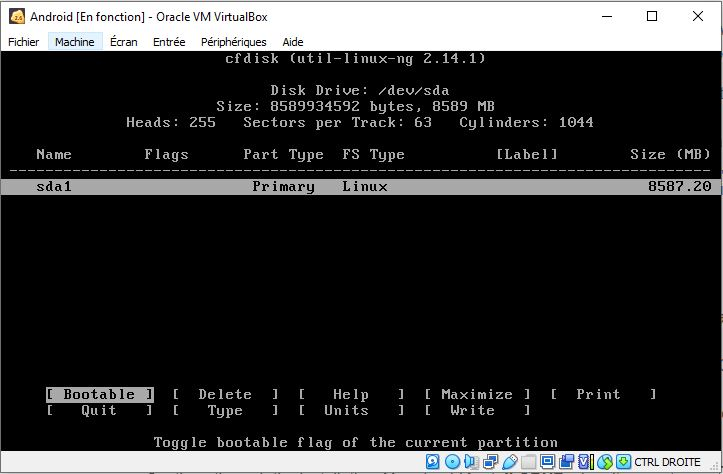

# My .NET MAUI Adventures

## Forewords

To begin, I would like to thank Chris Zenzel for is great lecture about bluetooth with MAUI.NET : <https://www.udemy.com/course/bluetooth-with-xamarin-maui/>

Thank again Chris to answer my noob questions :)

## Visual Studio 2022

First install Visual Studio 2022 with Mobile development options installed

## Download Android image

If it possible de use the Androit emulator bundled with Visual Studio 2022 but it will not possible to access physical device like Bluetooth for instance.

So we will use an Android image that will run into Virtual Box

We have to download the 32bits version (the 64bits may have some problems with debugging)

Download the image here : <https://www.android-x86.org/>

Follow the documentation here to install the image on Virtual Box : <https://www.android-x86.org/documentation/virtualbox.html>

Here is some settings:

Don't forget to remove this IDE Disk when installation is finished.

## Make the WifiVirt working

I haven't got any WiFi on my host computer.

But the Android image comes with a "Virtual WiFi" (VirtWifi).

It will use your host computer ethernet network.

Here is the configuration I have used to make it work.

## Make the bluetooth work

I bought a cheap Bluetooth USB Adapter on Amazon. 

Once connected, you show not activate the Bluetooth on the host computer.

You should add a new bluetooth controler as shown below:

At the begining, the Bluetooth refused to work properly (can't activate it on my Android VM).

I got the IP Address of my Android VM (via Advanced IP Scanner). For info, the name of the VM was "PCS Sytemtechnik GmbH".

Then, I stumbled across this issue : <https://github.com/android-x86/android-x86.github.io/issues/25>.

And I began to try connecting to the VM through the ADB (Android Debug Bridge).

I typed some of the command of the note : <https://github.com/android-x86/android-x86.github.io/issues/25#issuecomment-987476474>

I am not sure how I managed to make it work though...

Here is the result when it started to work:

In the picture below we can see the bluetooth working on my Android VM thanks to the great nRFConnect application.

## Debugging with Visual Studio 2022

First launch Visual Studio 2022 and then launch the Android ADB command line then connect to the Android VM.

Then you will be able de debug you project by selecting the local Android Device 

## Samples

You will find a sample project called `ble-helloworld` in the samples folder.

This very simple project scan for nearby bluetooth devices and display them in a list.

## Références

* [What is .NET MAUI?](https://learn.microsoft.com/en-us/dotnet/maui/what-is-maui?view=net-maui-7.0)

* [Build your first app](https://learn.microsoft.com/en-us/dotnet/maui/get-started/first-app?view=net-maui-7.0&tabs=vswin&pivots=devices-android)

* [Learn .NET MAUI - Full Course for Beginners | Build cross-platform apps in C#](https://www.youtube.com/watch?v=DuNLR_NJv8U&t=3418s)